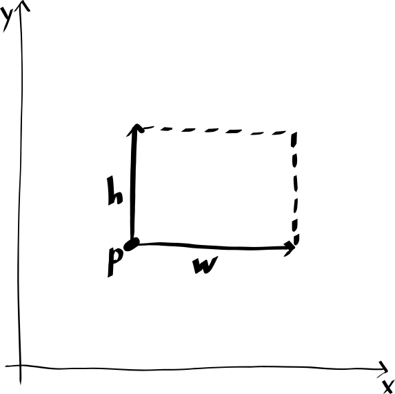
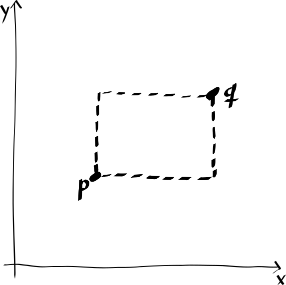

# Exercise 2.3

> Implement a representation for rectangles in a plane.
> (Hint: You may want to make use of Exercise 2.2.)
> In terms of your constructors and selectors, create procedures that compute the perimeter and the area of a given rectangle.
> Now implement a different representation for rectangles.
> Can you design your system with suitable abstraction barriers, so that the same perimeter and area procedures will work using either representation?

---

There seem to be (at least) two natural ways of representing a rectangle:

- We can represent a rectangle by one of its corner points, its horizontal length, and its vertical length.
  Depending on the choice of corner point, there are four such representations.
  Our preferred corner is the bottom-left one (i.e., the corner with the smallest $x$-coordinate and smallest $y$-coordinate).

  


- We represent a rectangle by a set of opposing corner points.
  There are two such representations.
  Our preferred choice of corners are the bottom-left and top-right ones.

  

In each case, our code will also work for the other conventions/choices.
(It is up to the user to choose a convention and then stick to it.)

Both representations of rectangles require us to handle points:
```scheme
(define (make-point x y) (cons x y))

(define (x-point p) (car p))

(define (y-point p) (cdr p))
```

We will implement `perimeter` and `area` in terms of auxiliary procedure `width` and `height`.
Both of these auxiliary procedures will later be implemented in a representation-dependent way, but `perimeter` and `area` will not depend on the choice of representation.
```scheme
(define (perimeter rect)
  (+ (* 2 (height rect))
     (* 2 (width rect))))

(define (area rect)
  (* (height rect)
     (width rect)))
```

The first representation can be implemented as follows:
```scheme
(define (make-rect corner width height)
  (cons corner
        (cons width height)))

(define (width rect)
  (car (cdr rect)))

(define (height rect)
  (cdr (cdr rect)))
```

The second representation can be implemented as follows:
```scheme
(define (make-rect p q)
  (cons p q))

(define (p-rect rect)
  (car rect))

(define (q-rect rect)
  (cdr rect))

(define (width rect)
  (let ((p (p-rect rect))
        (q (q-rect rect)))
    (abs (- (x-point p)
            (x-point q)))))

(define (height rect)
  (let ((p (p-rect rect))
        (q (q-rect rect)))
    (abs (- (y-point p)
            (y-point q)))))
```
