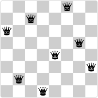

# Exercise 2.42

> The “eight-queens puzzle” asks how to place eight queens on a chessboard so that no queen is in check from any other (i.e., no two queens are in the same row, column, or diagonal).
> One possible solution is shown in the following image:.
>
> 
>
> One way to solve the puzzle is to work across the board, placing a queen in each column.
> Once we have placed $k - 1$ queens, we must place the $k$th queen in a position where it does not check any of the queens already on the board.
> We can formulate this approach recursively:
> Assume that we have already generated the sequence of all possible ways to place $k - 1$ queens in the first $k - 1$ columns of the board.
> For each of these ways, generate an extended set of positions by placing a queen in each row of the $k$th column.
> Now filter these, keeping only the positions for which the queen in the $k$th column is safe with respect to the other queens.
> This produces the sequence of all ways to place $k$ queens in the first $k$ columns.
> By continuing this process, we will produce not only one solution, but all solutions to the puzzle.
>
> We implement this solution as a procedure `queens`, which returns a sequence of all solutions to the problem of placing $n$ queens on an $n × n$ chessboard.
> `queens` has an internal procedure `queen-cols` that returns the sequence of all ways to place queens in the first $k$ columns of the board.
> ```scheme
> (define (queens board-size)
>   (define (queen-cols k)
>     (if (= k 0)
>         (list empty-board)
>         (filter
>          (lambda (positions) (safe? k positions))
>          (flatmap
>           (lambda (rest-of-queens)
>             (map (lambda (new-row)
>                    (adjoin-position new-row
>                                     k
>                                     rest-of-queens))
>                  (enumerate-interval 1 board-size)))
>           (queen-cols (- k 1))))))
>   (queen-cols board-size))
> ```
>
> In this procedure `rest-of-queens` is a way to place $k - 1$ queens in the first $k - 1$ columns, and `new-row` is a proposed row in which to place the queen for the $k$th column.
> Complete the program by implementing the representation for sets of board positions, including the procedure `adjoin-position`, which adjoins a new row-column position to a set of positions, and `empty-board`, which represents an empty set of positions.
> You must also write the procedure `safe?`, which determines for a set of positions, whether the queen in the $k$th column is safe with respect to the others.
> (Note that we need only check whether the new queen is safe---the other queens are already guaranteed safe with respect to each other.)


We start by defining a constructor and selectors for queens:
```scheme
(define (make-queen row column)
  (cons row column))

(define (queen-row q)
  (car q))

(define (queen-column q)
  (cdr q))
```
A position is simply a list of queens.
For the empty board, there is exactly one position, and we can add a new queen to a position via `cons`:
```scheme
(define empty-board '())

(define (adjoin-position new-row k rest-of-queens)
  (cons (make-queen new-row k) rest-of-queens))
```

To implement the procedure `safe?` we use an auxiliary procedure `first-multiple-times` that checks whether the first item of a list reoccurs later in the list.
```scheme
(define (member? x items)
  (if (null? items)
      false
      (or (= x (car items))
          (member? x (cdr items)))))

(define (first-multiple-times? items)
  (member? (car items) (cdr items)))
```

Each field on the chess board has four coordinates associated with it:
its row number $i$, its column number $j$, and its two diagonal numbers, which can be computed via $i + j$ and $i - j$.
The procedure `safe?` checks that the lastly added queen is different from the previous queens in her row number and both diagonal numbers.
```scheme
(define (safe? k queens)
  (define (free-coord? coord-function)
    (not (first-multiple-times? (map coord-function queens))))
  (and (free-coord? queen-row)
       (free-coord?
         (lambda (q) (- (queen-row q) (queen-column q))))
       (free-coord?
         (lambda (q) (+ (queen-row q) (queen-column q))))))
```
