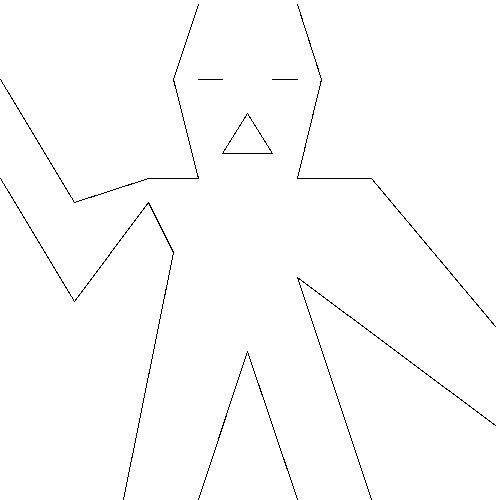
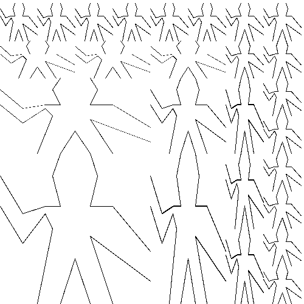
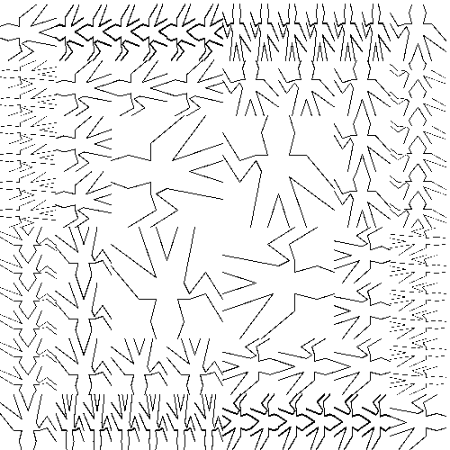

# Exercise 2.52

> Make changes to the square limit of `wave` shown in Figure 2.9 by working at each of the levels described above.
> In particular:
>
> 1. Add some segments to the primitive `wave` painter of Exercise 2.49 (to add a smile, for example).
>
> 2. Change the pattern constructed by `corner-split` (for example, by using only one copy of the `up-split` and `right-split` images instead of two).
>
> 3. Modify the version of `square-limit` that uses `square-of-four` so as to assemble the corners in a different pattern.
>    (For example, you might make the big Mr.~Rogers look outward from each corner of the square.)

---


### 1.

We reuse the auxiliary procedure `make-path` from Exercise 2.49:
```scheme
(define (make-path coords)
  (define (coords->vects coords)
    (if (null? coords)
        '()
        (cons (make-vect (car coords)
                         (cadr coords))
              (coords->vects (cddr coords)))))
  (define (iter vects)
    (if (null? (cdr vects))
        '()
        (cons (make-segment (car vects)
                            (cadr vects))
              (iter (cdr vects)))))
  (iter (coords->vects coords)))
```
We modify `wave` by adding a face:
```scheme
(define new-wave
  (let ((top-left (make-path (list 0.00 0.85
                                   0.15 0.60
                                   0.30 0.65
                                   0.40 0.65
                                   0.35 0.85
                                   0.40 1.00)))
        (left-eye (make-path (list 0.40 0.85
                                   0.45 0.85)))
        (mouth (make-path (list 0.50 0.78
                                0.45 0.70
                                0.55 0.70
                                0.50 0.78)))
        (right-eye (make-path (list 0.55 0.85
                                    0.60 0.85)))
        (top-right (make-path (list 0.60 1.00
                                    0.65 0.85
                                    0.60 0.65
                                    0.75 0.65
                                    1.00 0.35)))
        (bottom-right (make-path (list 1.00 0.15
                                       0.60 0.45
                                       0.75 0.00)))
        (bottom-center (make-path (list 0.60 0.00
                                        0.50 0.30
                                        0.40 0.00)))
        (bottom-left (make-path (list 0.25 0.00
                                      0.35 0.50
                                      0.30 0.60
                                      0.15 0.40
                                      0.00 0.65))))
    (segments->painter (append top-left
                               left-eye
                               mouth
                               right-eye
                               top-right
                               bottom-right
                               bottom-center
                               bottom-left))))
```
The resulting image is as follows:




### 2.

We modify the procedure `corner-split` as follows:
```scheme
(define (new-corner-split painter n)
  (if (= n 0)
      (below (beside painter painter)
             (beside painter painter))
      (let ((up (up-split painter n))
            (right (right-split painter n)))
        (let ((top-left up)
              (bottom-right right)
              (corner (new-corner-split painter (- n 1))))
          (beside (below painter top-left)
                  (below bottom-right corner))))))
```
The resulting image looks as follows:




### 3.

We can arrange the corners in a rotated way:
```scheme
(define (new-square-limit painter n)
  (let ((combine4 (square-of-four rotate90 identity
                                  rotate180 rotate270)))
    (combine4 (corner-split painter n))))
```
The resulting image looks as follows:


